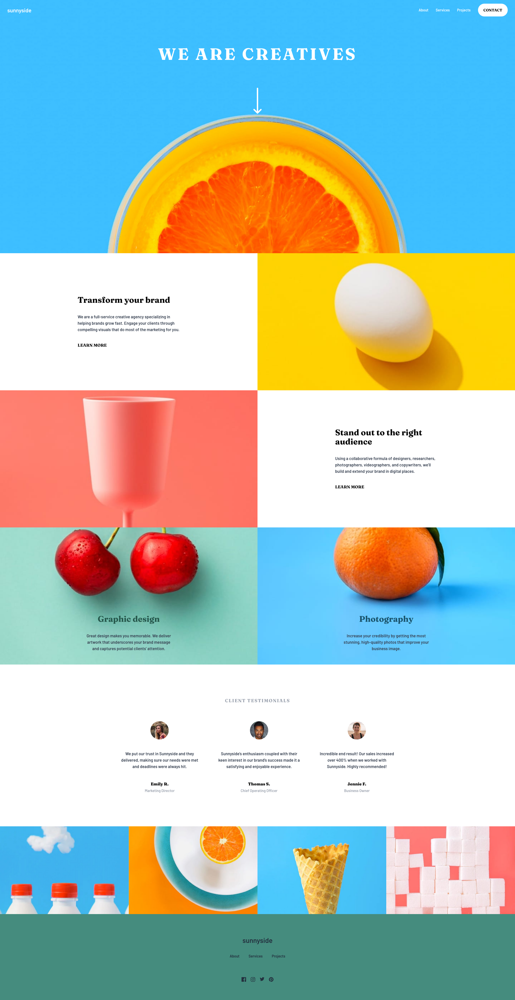

# Frontend Mentor - Sunnyside agency landing page solution

This is a solution to the [Sunnyside agency landing page challenge on Frontend Mentor](https://www.frontendmentor.io/challenges/sunnyside-agency-landing-page-7yVs3B6ef). Frontend Mentor challenges help you improve your coding skills by building realistic projects.

## Table of contents

- [Overview](#overview)
  - [The challenge](#the-challenge)
  - [Screenshot](#screenshot)
  - [Links](#links)
- [My process](#my-process)
  - [Built with](#built-with)
  - [Built with](#built-with)
- [Author](#author)

## Overview

### The challenge

Users should be able to:

- View the optimal layout for the site depending on their device's screen size
- See hover states for all interactive elements on the page

### Screenshot

### Links

- Solution URL: [Add solution URL here](https://your-solution-url.com)
- Live Site URL: [Add live site URL here](https://your-live-site-url.com)

## My process

### Built with

- Mobile-first workflow
- Semantic HTML5 markup
- Tailwind CSS
- Flexbox
- [React](https://reactjs.org/) - JS library

### What I learned

I used this project as a recap and refresher. I had taken a break from frontend development and wish to reginite the passion. This was a nice project due to the simple yet effective visual layouts and structure.

## Author

- Website - [Joshua Gretton](https://www.joshgretton.co.uk)
- Frontend Mentor - [@jgretton](https://www.frontendmentor.io/profile/jgretton)
